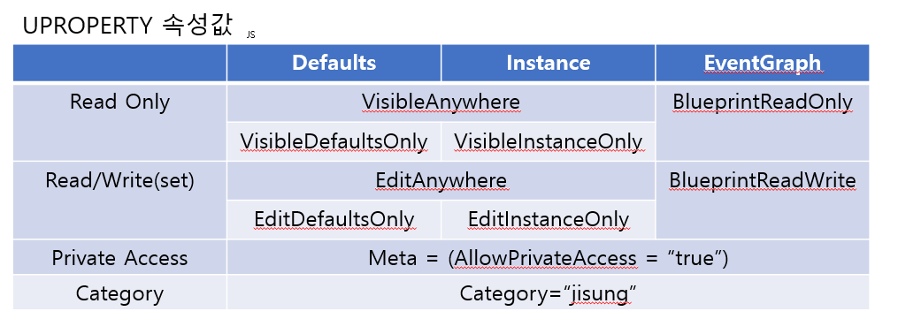
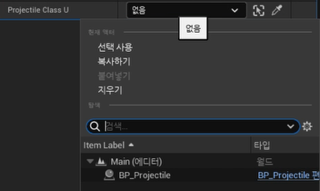
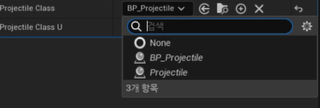
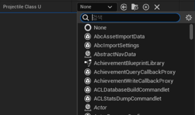

# Unreal_ToonTank

-[개요](#개요)  
-[개발시 알아둘것](#개발-시-알아둘것)  
    -[1. 전방선언](#1-클래스-전방선언)  

## 개요

Unreal 로 제작하는 첫 게임.  
그동안 Unity는 많이 사용해보았지만, Unreal에 관심이생겨 제작해보는 첫 프로젝트이다.

> ## **프로젝트에 사용한 map asset은 용량 및 저작권 관계로 push하지 않음 완성품은 영상 또는 gif로 확인**

## **제작후 느낀점**

1. 빌드를 해야 적용된다..  유니티는 cs코드를 저장하면 자동으로 컴파일후 빌드를 해줬지만, 언리얼은 빌드를 완료해야 바로 적용된다. 이거때문에 처음에 삽질 많이한듯.

2. 데미지를 주고 받는방식이 유니티에 비해 너무 힘들었다.
   유니티는 GetComponent().SetHealth(0); 이런식이 였다면, 
   언리얼은 delegate에 등록하고, 발사체의 Owner을 바꿔준다음, ApplyDamage호출해서야 그제서야 Damage를주는 함수를 실행시킬수 있었다. 이유야 많겠지만, 여러번 반복해봐야 검색없이 만들수 있을것같다.

3. 언리얼은 이미 대부분의 함수, 기능이 완성되어 있다.
   카메라 smooth , 카메라 shaking,  승리조건 등 유니티에선 사용자가 직접 구현해야될 기능이 이미 완성되어 있다. 언리얼에 익숙해지면 오히려 유니티가 불편해 질수도 있겠다는 생각이 들었다.  또한 UFUNCTION(BlueprintImplementableEvent)와 같은 기능을통해 블루프린트와 c++의 유기적으로 연동할 수 있고, 간단한 UI제작면에서는 오히려  쉬웠다.

4. posses, unpossess와 같은 빙의 기능이 이미 완성되어있다. 이거 이용해 게임만들어 보면 재미있을듯..?

 

## 언리얼 내용

\## 언리얼 내용

유니티와 달랐던 내용을 위주로 서술한다.

#### 1. 클래스 전방선언

이론적으로는 식별자를 정의하기전 식별자의 존재를 컴파일러에게 미리 알려주는 것으로 컴파일 시간을 단축시켜주고, 헤더포함 의존성을 줄여준다.  

```cpp
    class UCapsuleComponent* comp
```

위와 같은 선언을 전방선언이라 한다. 헤더파일에 다른 헤더파일을 include하게 될시 추후 다른 곳에서 불러올때 쓸대없이 다른 헤더파일을 포함하는 관계가 될 수 있다.  
이를 방지하기 위한것이 전방선언이다. 즉 구현부에는 #include "(사용할 헤더).h"를 할지라도, 선언부에는 전방선언으로 형태만 알려주는것이다.  
**이렇게 된것은 클래스에 대한 정보가 없으니 포인터만 사용해야 한다**  해당 객체 할당 크기를 정확히 파악할 수 없으니, 포인터형으로 선언 시 4바이트(32bit OS에서)를 할당한다.

#### 2. UPROPERTY



다만 component 들은 visible로만 해도 수정이 되는것을 볼 수 있는데 그 상황에서

Edit은 포인터 자체를 수정하겠다는 의미가 됩과

반면 Visible은 포인터의 멤버를 노출하겠다는 의미가 된다.

#### 3. 유니티와 비슷한듯 다른 언리얼의 이동법

```cpp
// header에 선언해주고,
//Pawn 클래스 내 SetupPlayerInputComponent(UInputComponent* PlayerInputComponent) 메소드가 있는데
// 이 메소드의 파라미터 값을 통해 Binding 한다
void APawn::SetupPlayerInputComponent(UInputComponent* PlayerInputComponent)
{
    Super::SetupPlayerInputComponent(PlayerInputComponent);

  /*
   BindAxis 파라미터
   TEXT("MoveForward") -> Project Setting 내 `입력`에서 설정한 이름 설정
   this -> 바인딩할 오브젝트
   &APawn::MoveForward -> 키 값을 적용할 메소드명(매개변수 로 값이 들어
  */
    PlayerInputComponent->BindAxis(TEXT("MoveForward"),this,&ATESTPawn::MoveForward);
}
```

Input.GetAxis, GetButton 등으로 불러왔던 유니티와는 다르게, 부모에서 상속받아 매개변수로 값을 넘겨받아오는 식이라 조금 신선해 적어뒀다.

#### 4. TSubclassOf vs 포인터로 받기 vs UClass

TSubclassOf는 UClass타입의 안전성을 보장해준다.

```cpp
UPROPERTY(EditAnywhere, Category="Combat")
AProjectile* projectileClass;

UPROPERTY(EditAnywhere, Category="Combat")
TSubclassOf<class AProjectile> ProjectileClass;

UPROPERTY(EditAnywhere, Category="Combat")
UClass* projectiles;
```

위 3가지의 차이점은 일단 다음 이미지를 참조해보자.



위 이미지는 AProjectile*



위 이미지는 TSubclassOf 



위 이미지는 UClass*이다

차이점을 보자면 먼저**Projectile로 Projectile파생 클래스를 집으려하면 인스턴스화 된것만 집을 수 있다.** (모든 포인터가 그렇다는건 아님!! UParticleSystem 같은것은 인스턴스 아닌것도 잡을수 있으므로 상황에 맞게 쓰자.)

두번째로**TSubclassOf를 보자면 Projectile파생 클래스에서 인스턴스가 된것이 아니라 해당 파생 클래스를 집을수 있게된다.**

세번째는**UClass 인데 클래스에 관계없이 모든 클래스를 선택할 수 있어 오류에 취약하다.**

#### 5. Actor vs ActorComponent

똑같이 Actor가 들어가서 잠깐 햇갈렸는데...   

ActorComponent는 재사용가능한 특정기능에 가깝고,
Actor는 이러한 기능들을 조합한 오브젝트이다.

즉 Scene에 배치할거면 Actor, Actor에 부착해 기능을 만들거면 ActorComponent이다.

#### 6. 편리한 Unreal의 GameMode

#### 대치되는듯한 함수

- 유니티에서의 게임오브젝트를 찾는(FindWith...) ->
  언리얼의  GetPlayerPawn (Kismet/GameplayStatics.h) (player index사용) 혹은
  GetAllActorsOfClass(this, 찾을class::StaticClass(), 반환받을 TArray) 

- 유니티의 캐스팅 as (예시 : Instantiate(a) **as** GameObject) ->
  언리얼의 캐스팅 Cast<바꿀형태>(바꿀것)(예시 : Cast<A>(B))

- 유니티의 생성 Instantiate ->
  언리얼의 생성 GetWorld() -> SpawnActor()

- 유니티에서의 충돌감지 OnCollisionEnter,... ->
  언리얼의 충돌감지 OnComponentHit
  다만 delegate에 등록시켜줄 함수는 아래를 매개변수로 가지고 있어야한다
  
  > OnHit(AProjectile *, void (__cdecl AProjectile::* )(AActor *,UPrimitiveComponent *,FVector,const FHitResult &), FName)
